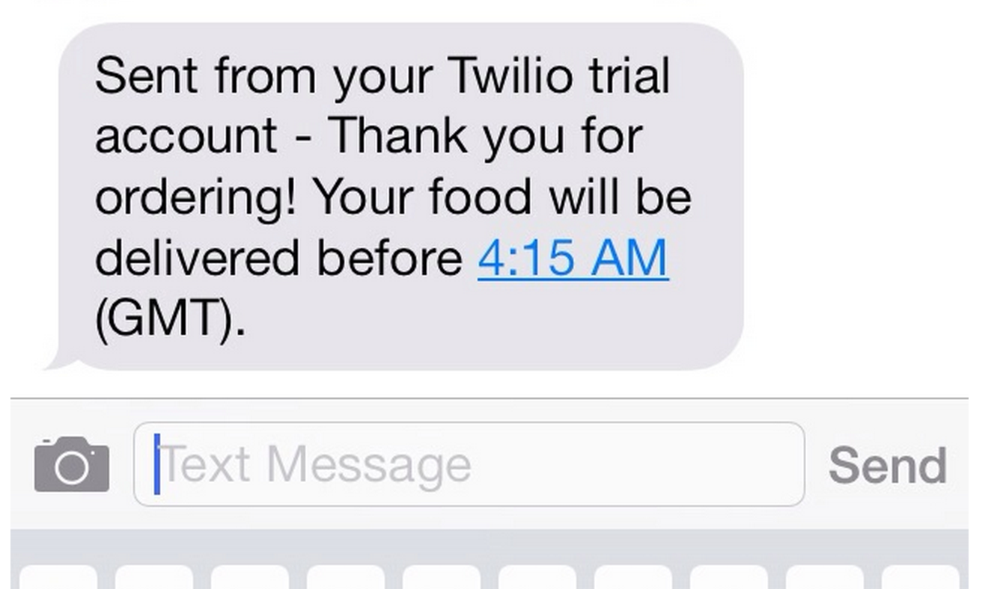

TakeAway
========
Makers Academy (Christmas Challenge)

Write a TakeAway command line app

Screen Shot of final Text
============

<div align="center">
        
</div>
<p></p>

Objectives of exercise
----

- Learning Ruby
- Command line
- Implement first API

Technologies used
----

- Sinatra
- Ruby
- Twilio API


Requirements
----
- [x] list dishes with prices
- [x] placing the order by giving the list of dishes, their quantities and a number that should be the exact total
- [x] If the sum is not correct the method should raise an error
- [x] otherwise the customer is sent a text saying that the order was placed successfully and that it will be delivered 1 hour from now

How to clone this repo
----
```sh
git clone https://github.com/HannahCarney/TakeAway.git
```

How to run tests
----
```sh
cd TakeAway
rspec
```

I am [Hannah] from the December 2014 cohort of Makers Academy, London!
[Hannah]:https://github.com/HannahCarney
Instructions
-------
